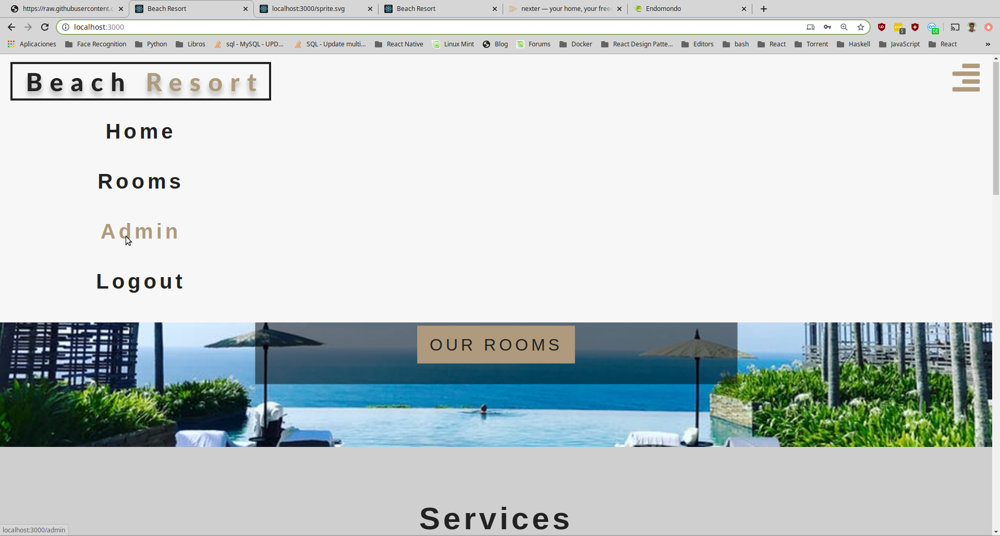
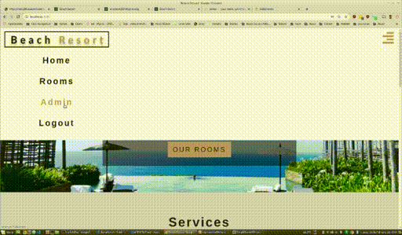
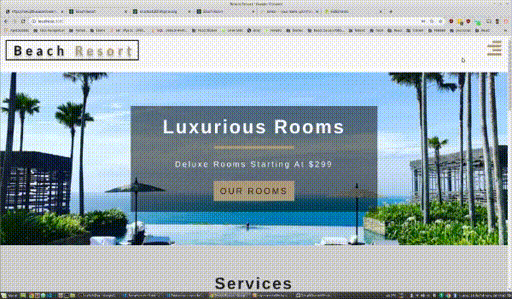
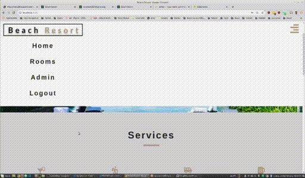
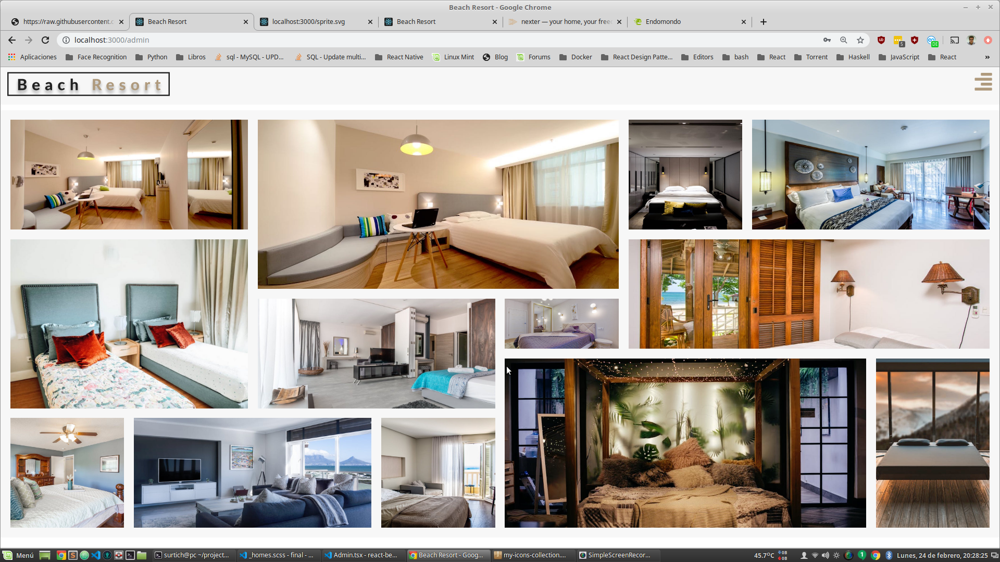
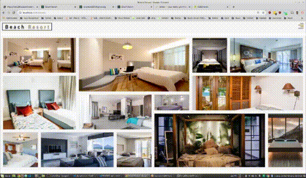
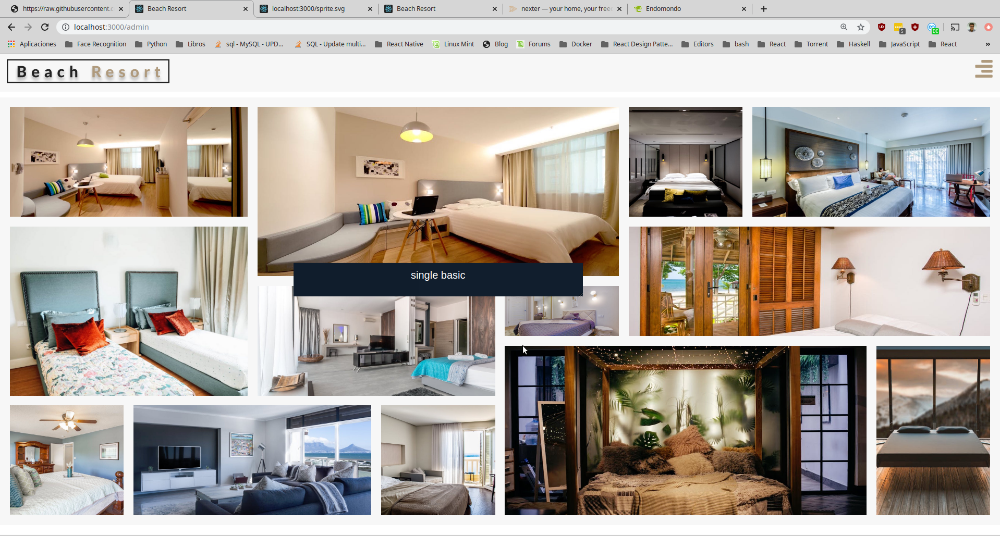
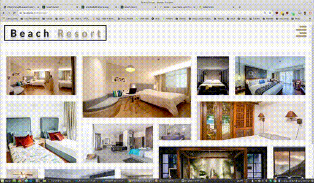

# Examen Segunda Evaluación

# Día 25/02/2020 Tiempo: 5 horas

- Nota: Cada pregunta se valorará como bien o como mal (valoraciones intermedias serán excepcionales).
- Nota2: En cada pregunta se especifica si se valora en el examen de diseño o en el de desarrollo o en ambos.
- Nota3: Para aprobar cada examen hay que obtener una puntuación mínima de 5 puntos en ese examen.
- Nota4: Organice su tiempo. Si no consigue resolver un apartado pase al siguiente. El examen consta de apartados de diseño y de desarrollo que por lo general se pueden resolver por separado. Si un apartado depende de otro que no sabe resolver, siempre puede dar una solución que aunque no sea correcta, le permita seguir avanzando.
- Nota5: Para que una solución sea correcta, no sólo hay que conseguir que haga lo que se pide, sino que además todo lo que funcionaba lo tiene que seguir haciendo.
- Nota6: Lea completamente el examen antes de empezar y comience por lo que le parezca más fácil.

Pasos previos antes de empezar

- Clone el repositorio del enunciado

```bash
git clone https://github.com/surtich/enunciado-examen.git
```

- Vaya al directorio del proyecto

```bash
cd enunciado-examen
```

- Configure su usuario de git:

```bash
git config user.name "Sustituya por su nombre y apellidos"
git config user.email "Sustituya por su correo electrónico"
```

- Cree un _branch_ con su nombre y apellidos separados con guiones (no incluya mayúsculas, acentos o caracteres no alfabéticos, excepción hecha de los guiones). Ejemplo:

```bash
    git checkout -b <fulanito-perez-gomez>
```

- Compruebe que está en la rama correcta:

```bash
    git status
```

- Suba la rama al repositorio remoto:

```bash
    git push origin <nombre-de-la-rama-dado-anteriormente>
```

- Instale las dependencias y arranque la aplicación:

```bash
    yarn install
    yarn start
```

Navegue a [http://localhost:3000](http://localhost:3000)

- Dígale al profesor que ya ha terminado para que compruebe que todo es correcto y desconecte la red.

## EXAMEN

El único ejercicio consiste en diseñar una página que permita cambiar el nombre de las habitaciones.


#### 1.- Admin.

#### 1.1.- (1 punto diseño) Añada una nueva opción al menú llamada `Admin`.



#### 1.2.- (2 puntos desarrollo) La opción de menú `Admin`sólo será visible cuando el usuario esté "logeado".



#### 1.3.- (1 punto diseño) El alto del menú se adaptará al número de opciones mostrada (ver vídeo anterior).

#### 1.4.- (1 punto diseño) Al pulsar sobre `Admin` se navegará a una nueva página.



#### 1.5.- (1 punto desarrollo) Si intenta navegar a `Admin` sin estar `logeado` se mostrará un mensaje.



#### 1.6.- (3 puntos diseño) Al navegar a `Admin` se mostrarán las trece imágenes de las habitaciones con la disposición de la imagen.

Nota: Es obligatorio hacerlo con grid o con flex. Las imágenes se adaptarán al tamaño de la pantalla sin variar su posición.



#### 1.7.- (1 punto desarrollo) Al pulsar sobre cada imagen se mostrará su nombre y (1 punto desarrollo) se ocultará el que se estuviera mostrando.



#### 1.8.- (2 puntos diseño) El estilo será el mostrado.



#### 1.9.- (1 punto desarrollo) Se podrá editar el nombre de la imagen y (1 punto desarrollo) al volver a mostrar el nombre la habitación se mostrará el modificado.

#### 1.10.- (2 puntos diseño) El estilo no variará (es decir, no se verá que está en una caja de texto.



#### 1.11.- (1 punto desarrollo) Al pulsar sobre "intro" o sobre "esc" se ocultará el nombre de la habitación y se almacenarán los cambios.

#### 1.12.- (2 puntos desarrollo) Los cambios en los nombres de las habitaciones se mantendrán entre vistas (/home, /rooms, /admin, ...).

Nota: Mire el vídeo inicial comprobará que los cambios hechos se mantienen entre todas las vistas.
Nota2: Este ejercicio puede resultar difícil ya que probablemente requerirá una refactorización en el uso del contexto de habitaciones.

## Para entregar

- Ejecute el siguiente comando para comprobar que está en la rama correcta y ver los ficheros que ha cambiado:

```bash
    git status
```

- Prepare los cambios para que se añadan al repositorio local:

```bash
    git add .
    git commit -m "completed exam"
```

- Compruebe que no tiene más cambios que incluir:

```bash
    git status
```

- Dígale al profesor que va a entregar el examen.

- Conecte la red y ejecute el siguiente comando:

```bash
    git push origin <nombre-de-la-rama>
```

- Abandone el aula en silencio.
